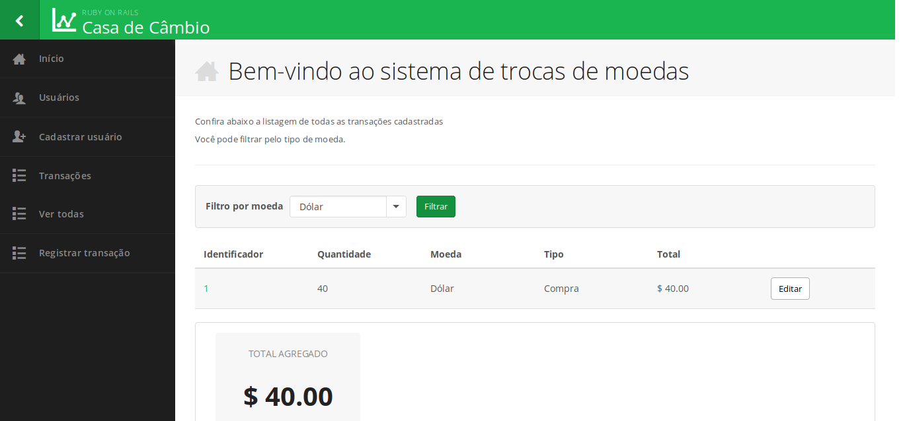

# CurrencyExchange - Ruby on Rails learning proposal website

This is a simple Transaction Register System made to learn some Ruby on Rails principles

* Ruby version: 2.5.1

* Rails version: 5.2.2

* Development and Test Database: SQLite3 

* Production Database: Postgres

* Template used: [Locastyle 3.0](https://github.com/locaweb/locawebstyle)

* To run the tests use rspec command

---

---
Thank you!
